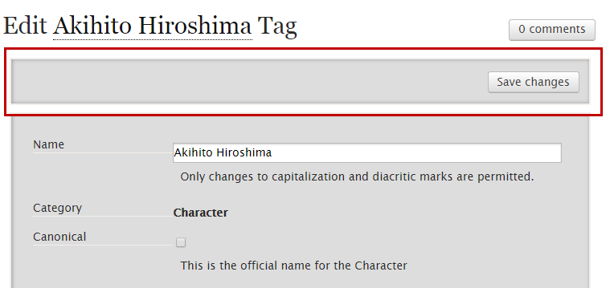
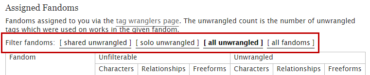
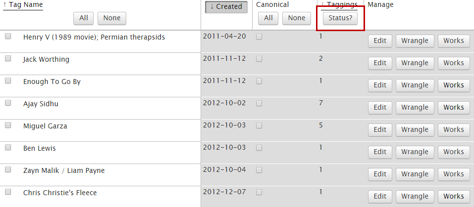
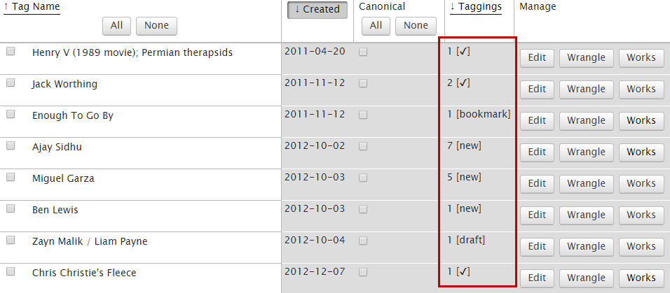
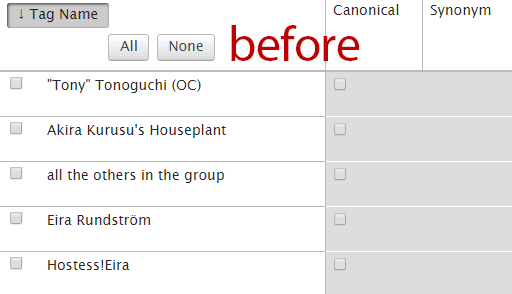

# AO3 Wrangling Scripts

A collection of userscripts for tag wrangling on [Archive of Our Own](https://archiveofourown.org), intended to make tag wranglers' lives easier.

If you use any of these and run into problems, feel free to ping me in OTW chat (@Relle) and I will do my best to help you out!

| Script | Install | Created | Updated |
| ------ | ------- | ------- | ------- |
| [Highlight Old Tags](#highlight-old-tags) | [GitHub](https://raw.githubusercontent.com/kaerstyne/ao3-wrangling-scripts/master/highlight-old-tags.user.js) &#124; [Greasy Fork](https://greasyfork.org/en/scripts/38866-ao3-wrangling-highlight-old-tags) | 2018-02-24 | [2019-04-12](CHANGELOG.md#highlight-old-tags) |
| [Save Changes at Top](#save-changes-at-top) | [GitHub](https://raw.githubusercontent.com/kaerstyne/ao3-wrangling-scripts/master/save-changes-at-top.user.js) &#124; [Greasy Fork](https://greasyfork.org/en/scripts/370820-ao3-wrangling-save-changes-at-top) | 2018-08-01 | [2019-04-12](CHANGELOG.md#save-changes-at-top) |
| [Wrangling Home Filter Redux](#wrangling-home-filter-redux) | [GitHub](https://raw.githubusercontent.com/kaerstyne/ao3-wrangling-scripts/master/wrangling-home-filter-redux.user.js) &#124; [Greasy Fork](https://greasyfork.org/en/scripts/381543-ao3-wrangling-wrangling-home-filter-redux) | 2019-04-08 | [2019-04-12](CHANGELOG.md#wrangling-home-filter-redux) |
| [Check Tag Status](#check-tag-status) | [GitHub](https://raw.githubusercontent.com/kaerstyne/ao3-wrangling-scripts/master/check-tag-status.user.js) &#124; [Greasy Fork](https://greasyfork.org/en/scripts/381677-ao3-wrangling-check-tag-status) | 2019-04-11 | [2019-04-12](CHANGELOG.md#check-tag-status) |
| [Hide Canonical Checkboxes](#hide-canonical-checkboxes) | [GitHub](https://raw.githubusercontent.com/kaerstyne/ao3-wrangling-scripts/master/hide-canonical-checkboxes.user.css) | 2018-02-28 | [2019-04-12](CHANGELOG.md#hide-canonical-checkboxes) |

## Highlight Old Tags

### Features

- Highlights the created date of older tags in your unwrangled bins, to help prioritize tags that have been sitting around for longer.
- Allows you to customize the highlight colors and the number of days before a tag is considered "old".
- Uses different colors for the Reversi site skin and will automatically switch to those when Reversi is active.

## Save Changes at Top

### Features

- On tag edit pages, adds a second Save Changes button at the top of the screen, so you don't have to scroll down to the bottom.

## Wrangling Home Filter Redux

### Features

- Based on Min's beloved [Wrangling Home Filter](https://greasyfork.org/en/scripts/10496-ao3-wrangling-home-filter) script, with additions.
- Allows filtering the wrangling home page to show only cowrangled or solo-wrangled fandoms with unwrangled tags.

### Warnings

- You have to manually edit the script code to include a list of your cowrangled fandoms; the script won't detect them automatically. See the code for further instructions.
- If you drop, pick up, or rename a cowrangled fandom, you'll have to update the list.
- **If you install a new version of the script, your list of cowrangled fandoms will be reset.** Be sure to save the list somewhere before updating!

### Options

| Option | Result |
| ------ | ------ |
| shared unwrangled | show only cowrangled fandoms with unwrangled tags |
| solo unwrangled | show only solo-wrangled fandoms with unwrangled tags |
| all unwrangled | show all fandoms with unwrangled tags |
| all fandoms | show all fandoms, whether they have unwrangled tags or not |

## Check Tag Status

### Features

- Adds a button to check if tags in your wrangling bins are only used on drafts, unrevealed works, etc.
- Has options specific to the mass bins.

### Warnings

- May behave oddly in certain edge cases. If you get unexpected results, please let me know so I can look into it!

### Statuses

| Status | Meaning |
| ------ | ------- |
| draft | tag is only used on draft works |
| bookmark | tag is only used on bookmarks |
| unrevealed | tag is only used on unrevealed works |
| new | **(mass bins only)** tag is only used on works less than two months old |
| ✔ | none of the above apply, tag is good to go |

## Hide Canonical Checkboxes

### Features

- Hides the canonical checkbox column on unwrangled tag pages, in case you're like me and constantly click on those by accident.
- Note: This is a CSS style, rather than a script, so you need to have [Stylus](https://add0n.com/stylus.html) or similar installed.
